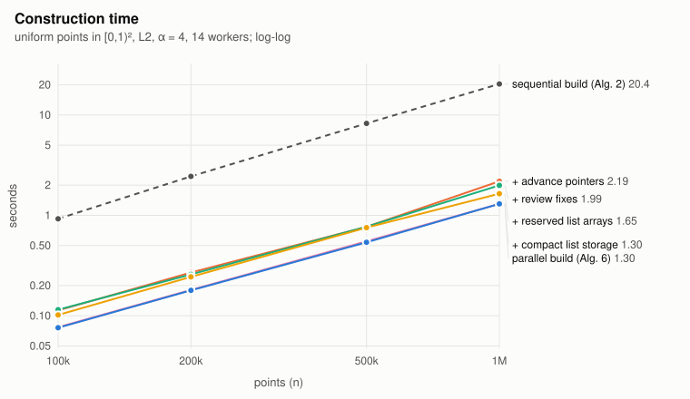
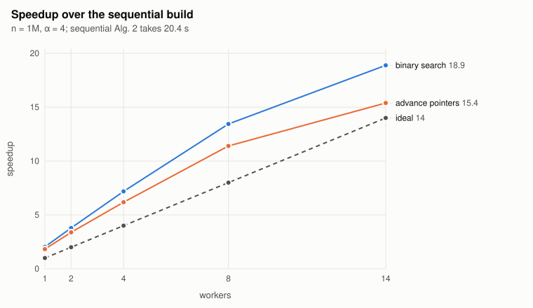
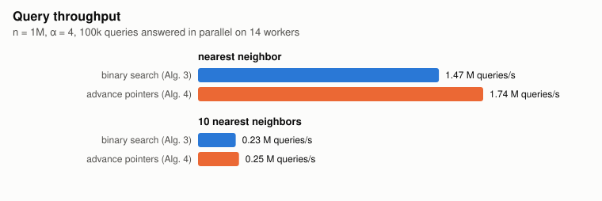
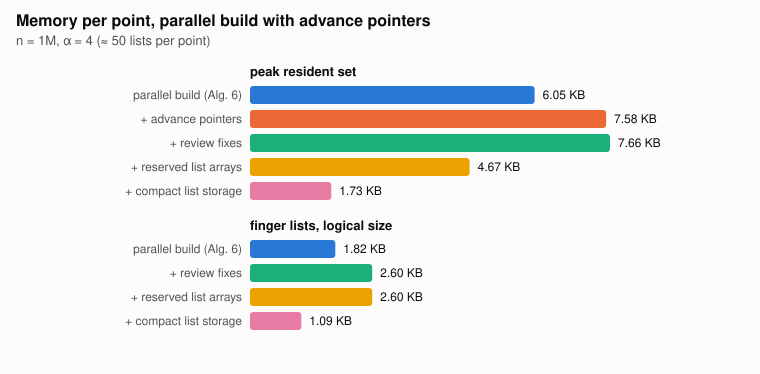

# par-skip: parallel metric skip lists

[](https://github.com/svishnus/par-skip/actions/workflows/ci.yml)

Exact nearest-neighbor, k-nearest-neighbor and range search in any metric
space, with a construction that runs in parallel on [ParlayLib](https://github.com/cmuparlay/parlaylib).
Header-only C++17.

It implements the metric skip list and its parallel construction from

> Xiangyun Ding, Rohin Garg, Yan Gu, Yihan Sun.
> *Parallel Metric Skip Lists and Nearest Neighbor Search.* SPAA '26.
> [`paper.pdf`](paper.pdf) (CC BY 4.0) · full version [arXiv:2606.03129](https://arxiv.org/abs/2606.03129).

A metric skip list needs nothing but a distance function: no coordinates, no
bounded aspect ratio. It is fast when the data has a low *expansion rate*
(the number of points within 2r of a point is at most a constant times the
number within r), which most real data does; the answers are exact
regardless.

## Quick start

```sh
git clone --recurse-submodules https://github.com/svishnus/par-skip.git
cd par-skip
make test                 # builds and runs the tests (clang++ or g++ >= 11, C++17)
make examples && build/examples/knn_graph 100000 10
```

```cpp
#include "mskip/metric.hpp"             // L2 / L1 / Linf over std::array<float, D>
#include "mskip/metric_skip_list.hpp"

using namespace mskip;
parlay::sequence<Point<2>> pts = ...;   // your points
MetricSkipList<L2<2>> S(pts, /*alpha=*/4);
S.build();                              // parallel; uses all ParlayLib workers

idx_t i     = S.nearest(q);             // index into pts
Neighbor nn = S.nearest_dist(q);        // {index, dist}
auto ten    = S.knn_dist(q, 10);        // parlay::sequence<Neighbor>, closest first
auto ball   = S.range(q, 0.01f);        // indices with d(p, q) < 0.01

// queries are const: run them in parallel
parlay::parallel_for(0, qs.size(), [&](size_t t) { out[t] = S.knn(qs[t], 10); });
```

To use it in your own build, add `-Iinclude` for this repo and `-isystem` for
ParlayLib's `include/` (plus `-pthread` on Linux); everything is in
`namespace mskip`. There is nothing to link.

## API

| call | what it does |
|---|---|
| `MetricSkipList<Metric>(pts, alpha, metric = {}, seed = 0)` | copies the points in a random order (deterministic for a seed); `alpha` in 1…255 |
| `build()` / `build_parallel(seq_base, advance)` | parallel construction (Alg. 6 + advance pointers); `advance = false` drops the pointers |
| `build_sequential(advance)` | the sequential algorithm (Alg. 5 / Alg. 2); same structure, bit for bit |
| `nearest(q)`, `nearest_dist(q)` | the closest point (ties: the one earliest in the permutation) |
| `knn(q, k)`, `knn_dist(q, k)` | the `min(k, n)` closest, by distance then priority |
| `range(q, delta)`, `range_dist(q, delta)` | every point with `d < delta`, in discovery order |
| `set_checkpoint_stride(s)` | how often a list is stored in full (default `max(alpha, 8)`); smaller is faster, larger is smaller |
| `n()`, `alpha()`, `permutation()`, `lists(i)`, `stats()`, `memory_bytes()`, `allocated_bytes()` | introspection |

Queries are exact for every `alpha` and safe to call concurrently once a
build has finished. Errors are exceptions: `std::invalid_argument` for a bad
`alpha` or too many points, `std::logic_error` for a query before a build.

**Choosing alpha.** Each point keeps, for every radius, the `alpha`
highest-priority points inside that radius. Bigger `alpha` means shorter
walks but more lists per point: about 21 bytes per list plus a full copy
every `stride` lists, i.e. Θ(α ln n) per point — about 1.1 KB at
`alpha = 4` and 2.2 KB at `alpha = 8` for 10⁶ / 2·10⁵ points (the resident
set is ≈ 1.6× that during the build; `build_parallel(seq_base, false)`
drops the pointers and saves a further quarter). 4–8 is a good range for
2D/3D data; higher dimensions want more (the paper's analysis needs `alpha`
to grow with the expansion rate).

**Custom metrics.** A metric is a type with `point_type`,
`dist_t operator()(const point_type&, const point_type&) const` and
`static constexpr dist_t slack`. Computed distances must be finite,
non-negative and symmetric, and satisfy the triangle inequality up to a
relative `slack` (rounding); the search balls are enlarged by `1 + slack`.
Exact metrics use `0`; the built-in float metrics use 4 ulps. See
[`examples/custom_metric.cpp`](examples/custom_metric.cpp) (Hamming distance
on bit strings).

## Performance

Uniform points in [0,1)², L2, `alpha = 4`, on an Apple M4 Pro (14 cores). The
figures follow the implementation through its milestones; regenerate them
with `bench/history.sh && python3 bench/plot.py` (raw numbers in
[`bench/results/history.csv`](bench/results/history.csv)).









What the figures say:

* The parallel build is 15× faster than the sequential algorithm on 14
  cores at n = 10⁶ (1.3 s vs 20 s), and beats it on a single worker, too: the
  divide-and-conquer order is friendlier to the caches. Scaling flattens past
  8 workers because the build is bound by memory traffic (the structure is
  walked at random).
* Advance pointers (the paper's Sec. 4/5.5) make nearest-neighbor queries
  ≈ 5–15 % faster and 10-NN queries ≈ 10 % faster; they cost ≈ 20 % more
  build time and ≈ 25 % more memory. `build_parallel(seq_base, false)` skips them
  if construction time or memory matters more than query time.
* Reserving each point's lists once instead of growing them took the peak
  memory from 7.4 KB to 4.7 KB per point and the build from 2.6 s to 1.7 s.
* The compact list storage (consecutive lists differ by one entry, so a
  list is stored as that difference, with a full copy every few lists) took
  the lists from 2.5 KB to 1.1 KB per point at `alpha = 4` (7.9 KB to 2.2 KB
  at `alpha = 8`), the peak memory from 4.7 KB to 1.7 KB per point, and the
  build from 1.65 s to 1.3 s, as fast as the build without pointers was;
  nearest-neighbor queries are unchanged, 10-NN queries at `alpha = 4` are
  ≈ 7 % slower because only every eighth list carries pointers for all its
  entries (`set_checkpoint_stride` trades that against memory).

Two caveats worth knowing: with a small `alpha` in higher dimensions, and
for queries far from all the data, the walks get long (hundreds of steps);
the answers stay exact, only the speed is lost.

## Testing

```sh
make test            # all tests, -O3 -march=native
make test-all        # also with one worker, PARLAY_SEQUENTIAL, and ASan/UBSan
make TSAN=1 test     # ThreadSanitizer
```

The tests check every finger list, advance pointer and control point of the
parallel build against the sequential one (bit for bit, up to 10⁵ points and
over thousands of small configurations), both against a builder that
follows the paper's definition literally, and every query against brute
force — including inputs with many equal distances, adversarial
permutations, and a rounding case where float distances break the triangle
inequality. CI runs the suite with g++ and clang on Linux and macOS.

## How it works

Every point `s_i` keeps *finger lists*: for each radius, the `alpha`
highest-priority points within that radius, where priority is a random
permutation. A query is a random walk over these lists that halves its
distance rank in expectation at every step. Construction is the same walk
run for each point over the lists of the points after it.

Consecutive lists of a point differ by one entry, so a point stores its first
list in full and then, per list, the entry that came in and the one it
replaced, with a full copy every few lists; a list is rebuilt from the
nearest copy with a few bit operations when the walk reads it.

The parallel construction splits the permutation in half, builds both halves
in parallel, then completes the left half against the right half by resuming
each walk exactly where it was blocked. Walks that were blocked at the same
point form a shallow forest, processed layer by layer. Advance pointers
(Sec. 4 / 5.5 of the paper) replace the binary search for the focus list; in
the parallel build they are settled through per-point pending lists after
each merge instead of the paper's advance tree, which keeps the walk and the
resulting structure identical to the sequential algorithm.

[`docs/PLAN.md`](docs/PLAN.md) has the invariants, the tie rule that makes
all builders agree, the gaps in the paper's pseudocode and how they were
filled, and the measurements behind the design decisions.

## Layout

```
include/mskip/   the library: metric_skip_list.hpp (include this), metric.hpp,
                 finger_list.hpp, walk.hpp, build_seq.hpp, build_par.hpp, query.hpp,
                 data.hpp (generators), reference.hpp (oracles for the tests)
examples/        knn_graph.cpp, custom_metric.cpp
tests/           make test
bench/           bench_build, bench_query, scaling.sh, history.sh, plot.py, results/
docs/            PLAN.md, plots/
external/        ParlayLib submodule
```

Commits follow [Conventional Commits](https://www.conventionalcommits.org/)
and are signed. MIT license; the paper is CC BY 4.0.
